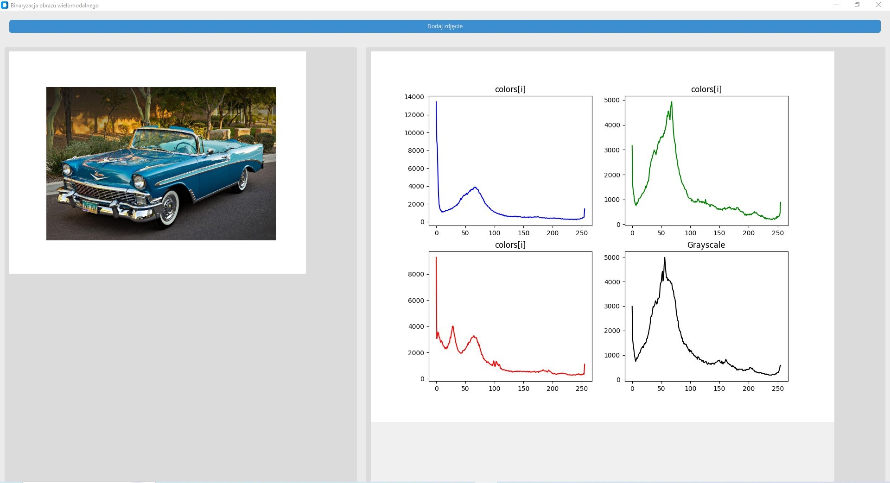
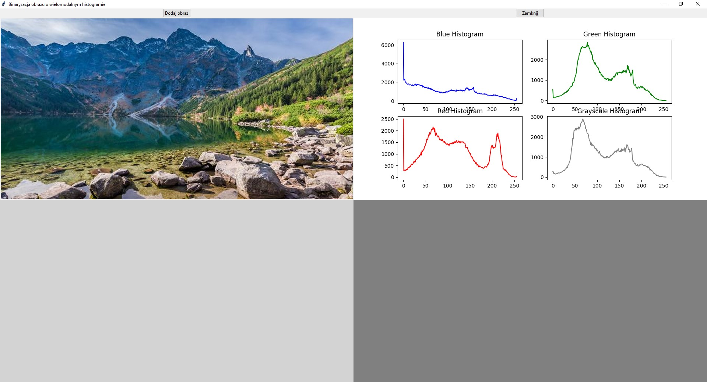

# AiPO
Project from the Image Analysis and Processing course (AIPO) involving the implementation of image binarization with a multimodal histogram using the maximum entropy method.

Tkinter version
